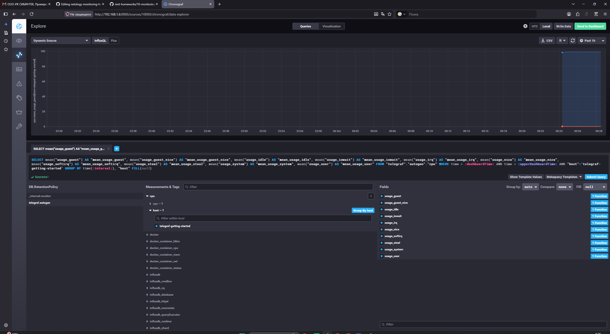
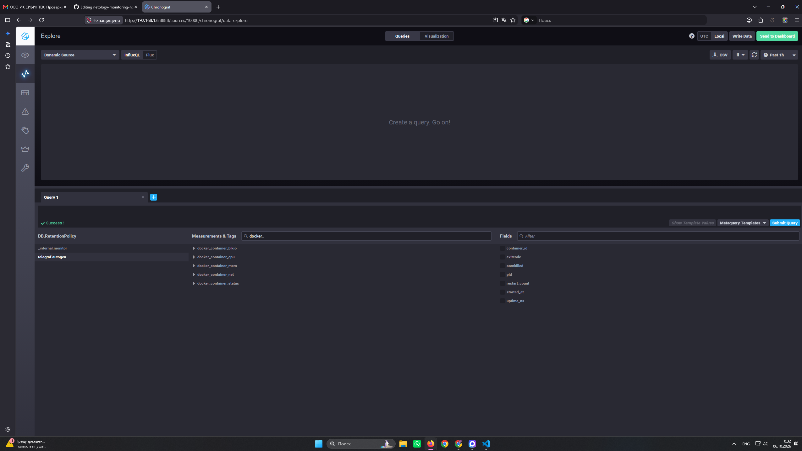

# Теоретические вопросы

## Вопрос 1

### Задание 

Вас пригласили настроить мониторинг на проект. На онбординге вам рассказали, что проект представляет из себя платформу для вычислений с выдачей текстовых отчетов, которые сохраняются на диск. Взаимодействие с платформой осуществляется по протоколу http. Также вам отметили, что вычисления загружают ЦПУ. Какой минимальный набор метрик вы выведите в мониторинг и почему?

### Ответ

Первично необходимо реализовать мониторинг загрузки CPU на еденицу времени и load average. Вычисления загружают CPU поэтому единоразовое повышение загрузки в момент выполнения операции закономерно, но высокий LA показатель сбоев в работе.
Потом нам необходим мониторинг RAM, так как в момент критической утилизации RAM из-за большого количества данных сработает OOM Killer. Также реализуем мониторинг свободного места на дисках, мониторинг inodes и disk I/O. Реализуем мониторинг http. Сколько запросов в единицу времени проходит, сколько он отдаёт 400ых и 500ых кодов и как быстро но дает ответ на запрос.

## Вопрос 2

### Задание 

Менеджер продукта посмотрев на ваши метрики сказал, что ему непонятно что такое RAM/inodes/CPUla. Также он сказал, что хочет понимать, насколько мы выполняем свои обязанности перед клиентами и какое качество обслуживания. Что вы можете ему предложить?

### Ответ

Можно ввести отдельные метрики для менеджеров и заказчика. SLA, SLI, SLO. Например доля успешных HTTP запросов от общего количества, время выполнения запроса, доля ошибок на количество запросов.

## Вопрос 3

### Задание 

Вашей DevOps команде в этом году не выделили финансирование на построение системы сбора логов. Разработчики в свою очередь хотят видеть все ошибки, которые выдают их приложения. Какое решение вы можете предпринять в этой ситуации, чтобы разработчики получали ошибки приложения?

### Ответ

Не могу точно сказать, вариантов несколько:

1. Построить мониторинг на бесплатных opensource решениях, что не затратит финанс на софт, но есть вероятность затрат на инфраструктуру под систему мониторинг. 
2. Читать ошибки с journalctl(если программа пишет лог отдельно, то читать лог файл программы) настроить пересылку логов через rsyslog.
3. Прям в приложении писать обработку ошибок и вызов вебхука в телеграм или отправку сообщения в какой-небудь другой чат/месенджер по API

## Вопрос 4

### Задание 

Вы, как опытный SRE, сделали мониторинг, куда вывели отображения выполнения SLA=99% по http кодам ответов. Вычисляете этот параметр по следующей формуле: summ_2xx_requests/summ_all_requests. Данный параметр не поднимается выше 70%, но при этом в вашей системе нет кодов ответа 5xx и 4xx. Где у вас ошибка?

### Ответ

Есл разобрать формулу расчета, мы считаем количество 200ых кодов относитьельно всех ответов. То есть 300ые коды  мы автоматически засчитываем как ошибочные. 
(summ_2xx_requests + summ_intentional_3xx_requests) / summ_all_requests

## Вопрос 5

### Задание 

Опишите основные плюсы и минусы pull и push систем мониторинга.

### Ответ

Pull 

Плюсы:

приложение и система мониторинга слабо связаны, приложение просто отдаёт метрики, а как и когда их забирать решает сервер, это вообще не касается программы
сразу понятно, что нода недоступна: рвётся соединение, таймаут или nginx отдаёт 5XX
все настройки (таргеты, частота опроса, трансформации метрик) в одном месте, на сервере

Минусы:

короткоживущим приложениям (job отработал и завершился) такой подход не подходит, не успеют опросить
приложение должно быть доступно снаружи, а если оно за NAT, надо прокидывать порт; мобильные приложения так вообще не замониторить
больше возни с безопасностью: нужен реверс-прокси (nginx), закрытый файрволл кроме сервера мониторинга, экспортёр слушает только 127.0.0.1
деплой сложнее, надо настраивать и прокси, и файрволл, и сам экспортёр
масштабируется сначала вертикально, потом горизонтально через federation, это усложняет архитектуру

Push 

Плюсы:

единственный вариант для короткоживущих приложений
не важно, доступно ли приложение снаружи, работает через NAT, годится и для мобильных приложений, достаточно чтобы оно само достучалось до центральной ноды
безопасность проще, защищаешь только центральную ноду, больше ничего открывать не надо
деплой проще, прописал адрес ноды и ключи, и всё
масштабирование изначально легче, нагрузка и так распределена по агентам

Минусы:

приложение должно знать куда слать и хранить авторизационные ключи, связность выше
сложнее понять причину недоступности: упал агент, сервер, сеть или приложение переехало, непонятно без допкопаний
настройки не централизованы, доставка конфигов и ключей на каждый агент это отдельная головная боль

## Вопрос 6

### Задание 

Какие из ниже перечисленных систем относятся к push модели, а какие к pull? А может есть гибридные?

    Prometheus
    TICK
    Zabbix
    VictoriaMetrics
    Nagios

### Ответ

    Prometheus(pull)
    TICK(push)
    Zabbix(гибрид)
    VictoriaMetrics(pull)
    Nagios(pull, но иногда push)

# Практика

## Задание 7, 8

## Задание 9

